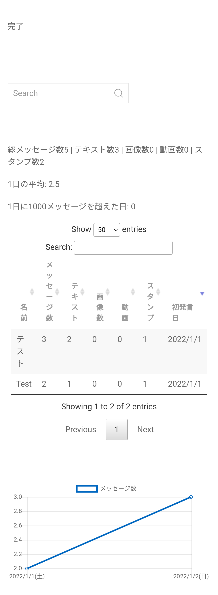

# LINE-Log-Viewer

新しい[やつ](https://github.com/HRTK92/line-viewer)

## 使い方

1.Lineのグループから「トーク履歴の送信」を押してtxtファイルをダウンロードする

2.このサイトにtxtファイルをアップロードする

3.「読み込む」をクリック

## 見れるもの

- グループのメッセージ数
- グループの1日の平均メッセージ数
- グループの画像 動画 スタンプ数
- ユーザー
  - メッセージ
  - 画像 動画 スタンプ数
- すべての日付のメッセージ数(グラフ)

## デモ

